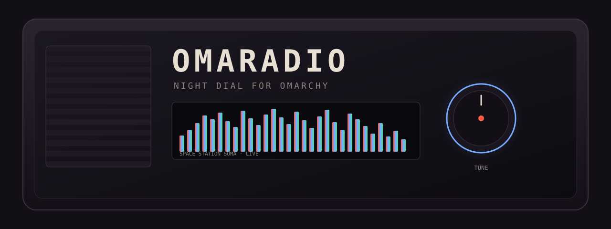

<p align="center">
  
</p>

<p align="center">
  <strong>Night-dial terminal radio.</strong> Small TUI. mpv under the hood.<br>
  CrabMusic braille bars. Built to live in a tiling terminal on Omarchy.
</p>

<p align="center">
  Named after Pierre's <a href="https://github.com/PierrunoYT/OpenRadio">OpenRadio</a>
  — go star his repos. This is the Omarchy night-dial, not a fork of his player.
</p>

<p align="center">
  <code>cargo install --path . --force && openradio</code>
</p>

---

```
┌ OPENRADIO  ·  SPACE STATION ──────────────────────── vol ██████░░░░ 70 ┐
│  ● LIVE                                                                │
│  Space Station  ·  drifting through the ionosphere                     │
│                                                                        │
│   ⢀⣀⣤⣶⣿⣿⣶⣤⣀⡀⢀⣀⣤⣶⣿⣷⣤⣀⢀⣀⣴⣿⣿⣦⣀⡀⣤⣶⣿⣿⣶⣤⡀⣀⣤⣿⣿⣤⣀  │
│   ⣿⣿⣿⣿⣿⣿⣿⣿⣿⣿⣿⣿⣿⣿⣿⣿⣿⣿⣿⣿⣿⣿⣿⣿⣿⣿⣿⣿⣿⣿⣿⣿⣿⣿⣿⣿⣿⣿  │
│                                                                        │
├ dial ──────────────────────────────────────────────────────────────────┤
│  ▶ 3   Space Station       SomaFM  ·  tune in, turn on, space out      │
│    5   Jazz Groove         The Jazz Groove  ·  after-midnight jazz     │
│    6   Midnight Blues      Jazz Radio — Blues  ·  slow blues           │
│  ↑↓/jk  ⏎ play  space pause  +/- vol  ? credits  q quit                │
└────────────────────────────────────────────────────────────────────────┘
```

Needs **mpv** on `PATH` — the usual Arch / Omarchy audio Swiss Army knife.

```bash
# Omarchy / Arch
sudo pacman -S mpv
git clone https://github.com/newjordan/openradio_omarchy.git
cd openradio_omarchy
cargo install --path . --force
openradio
```

Or from the crate without installing:

```bash
cargo run --release
```

## Dial

Default tune is Space Station. Bars pick a mood per station — liquid punches
the low end and hats, space breathes, jazz stays sparse, OTR sits in the
voice band.

| # | Station | Broadcaster | Why it's there |
|---|---------|-------------|----------------|
| 1 | Old Time Radio | [WALM Radio](https://walmradio.com) | Golden-age drama and mystery |
| 2 | Liquid DnB | Liquid DnB | Rolling liquid funk |
| 3 | Space Station | [SomaFM](https://somafm.com/spacestation/) | Deep-space ambient |
| 4 | Mission Control | [SomaFM](https://somafm.com/missioncontrol/) | NASA comms over pads |
| 5 | Jazz Groove | [The Jazz Groove](https://www.thejazzgroove.com) | After-midnight slow jazz, no chatter |
| 6 | Midnight Blues | [Jazz Radio](https://www.jazzradio.fr) | Slow blues after hours |
| 7 | WWOZ New Orleans | [WWOZ 90.7 FM](https://www.wwoz.org) | Live from the Quarter |

Streams belong to the broadcasters. This is an unofficial tuner. Full credits
live in **[ATTRIBUTION.md](ATTRIBUTION.md)** and on the in-app `?` card.

## Keys

| Key | Action |
|-----|--------|
| `↑↓` / `jk` | Select |
| `Enter` / `l` | Play |
| `space` | Pause |
| `+/-` `←→` | Volume |
| `[]` `n` `p` | Previous / next and play |
| `1-7` | Jump |
| `s` | Stop |
| `?` / `h` | Credits |
| `q` | Quit |

## How it works

- **Playback** is [mpv](https://mpv.io) over JSON IPC — ICY titles, Soma `.pls`
  failover, volume. We spawn mpv; we do not link it.
- **Visualizer** is a slice of [CrabMusic](https://github.com/newjordan/crabmusic)'s
  braille columns + peak gravity, MIT © 2025 Frosty40. Bars are a real FFT of
  the PipeWire sink monitor — the speaker mix — not a canned oscillator.
- **Desktop** target is [Omarchy](https://omarchy.org). It will run in any
  terminal that can do Unicode braille and 24-bit color.

## License

openradio is [MIT](LICENSE) © 2026 Frosty40.

The name is Pierre's. His OpenRadio is MIT © 2026 PierrunoYT —
[`third_party/PIERRUNOYT_OPENRADIO_LICENSE`](third_party/PIERRUNOYT_OPENRADIO_LICENSE).
CrabMusic's MIT notice is preserved in
[`third_party/CRABMUSIC_LICENSE`](third_party/CRABMUSIC_LICENSE). mpv remains
GPL-2.0-or-later as a separate program you install yourself.

Not affiliated with Pierre's OpenRadio, SomaFM, WWOZ, WALM, The Jazz Groove,
Jazz Radio, Omarchy, or mpv. SomaFM® is a trademark of SomaFM.
